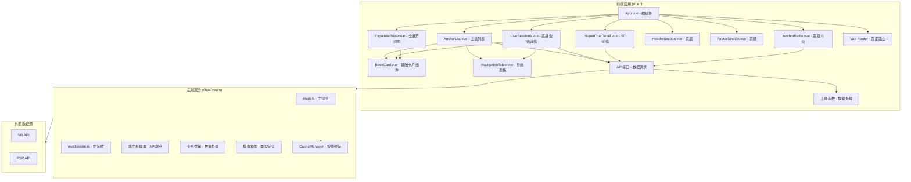

# 系统架构总览

## 项目概述

维阿PSP斗虫榜是一个用于展示维阿（VirtuaReal）和PSP（PSPlive）工会主播直播数据的应用。采用前后端分离架构。

## 技术栈

- **后端**: Rust + Axum + Tokio
- **前端**: Vue 3 + Vite + Vue Router + Chart.js
- **API协议**: RESTful API
- **数据来源**: 从外部API获取主播数据

## 系统架构图



## 数据流

```
用户访问 → Vue Router → Vue组件 → API请求 → Rust后端 → 外部API
                                                ↓
                                          CacheManager（缓存层）
```

1. 前端通过 Vue Router 管理页面路由
2. Vue 组件通过 `api/index.js` 发起 HTTP 请求
3. 后端 Axum 路由接收请求，先查询缓存
4. 缓存未命中时调用外部 API 获取数据
5. 数据经处理后返回前端展示

## 目录结构

```
liveshow/
├── docs/                            # 项目文档
├── frontend/                        # Vue前端项目
│   ├── src/
│   │   ├── api/                     # API接口定义
│   │   ├── components/              # Vue组件
│   │   ├── composables/             # 组合式API函数
│   │   ├── router/                  # 路由配置
│   │   ├── utils/                   # 工具函数
│   │   ├── assets/                  # 静态资源
│   │   ├── App.vue                  # 根组件
│   │   └── main.js                  # 入口文件
│   ├── public/                      # 静态资源
│   └── Douchong/                    # 斗虫榜相关资源
└── rust_backend/                    # Rust后端项目
    ├── src/
    │   ├── main.rs                  # 主程序
    │   ├── main_optimized.rs        # 优化版主程序
    │   └── middleware.rs            # 中间件
    ├── cache_data/                  # 缓存数据目录
    └── Cargo.toml                   # 依赖配置
```

## 端口配置

- **后端服务**: `http://0.0.0.0:2992`
- **前端开发**: `http://localhost:3000`
