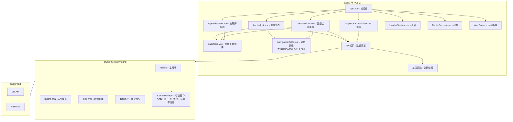

# 维阿PSP斗虫榜

一个用于展示维阿（VirtuaReal）和PSP（PSPlive）工会主播直播数据的应用。

## 项目概述

维阿PSP斗虫榜是一个用于展示维阿（VirtuaReal）和PSP（PSPlive）工会主播直播数据的应用。该项目采用前后端分离架构，使用Rust/Axum作为后端API服务，Vue 3/Vite作为前端用户界面。

## 快速开始

### 传统部署方式

参考下面的安装与运行部分。

### 主要技术栈
- **后端**: Rust + Axum + Tokio
- **前端**: Vue 3 + Vite + Vue Router + Chart.js
- **API协议**: RESTful API
- **数据来源**: 从外部API获取主播数据
- **优化配置**: 包含性能优化的Cargo.toml.optimized配置文件
- **组件架构**: 采用可复用的BaseCard组件和导航表格

### 核心功能
- 展示维阿和PSP工会主播的收入数据
- 按月份查看历史数据
- 查看特定主播的详细直播会话信息
- 数据可视化（营收占比饼图和工会对比图）
- 按工会筛选功能（VR/PSP/全部）
- Super Chat历史记录查看
- 回归分析和聚类分析功能

## 项目结构

```
liveshow/
├── APIDOC.md                       # API文档
├── readme.md                       # 项目介绍
├── responsive_test_optimized.html  # 响应式测试优化页面
├── RESPONSIVE_TEST_REPORT.md       # 响应式测试报告
├── responsive_test.html            # 响应式测试页面
├── scroll_test.html                # 滚动测试页面
├── simple_start.bat                # 简易Windows启动脚本
├── snapshot.html                   # 快照页面
├── start.bat                       # Windows启动脚本
├── start.sh                        # Linux/Mac启动脚本
├── test_responsive.js              # 响应式测试脚本
├── test_server_only.bat            # 仅测试服务器批处理
├── testf.md                        # 测试文档
├── verify_changes_fixed.js         # 验证更改修复脚本
├── verify_changes.js               # 验证更改脚本
├── frontend/                       # Vue前端项目
│   ├── package.json                # 前端依赖配置
│   ├── babel.config.js             # Babel配置文件
│   ├── index.html                  # 前端入口HTML文件
│   ├── jsconfig.json               # JavaScript配置
│   ├── vite.config.js              # Vite构建工具配置
│   ├── vue.config.js               # Vue CLI配置
│   ├── public/                     # 静态资源
│   ├── Douchong/                   # 斗虫榜相关资源
│   ├── dist/                       # 构建输出目录
│   ├── src/                        # 前端源代码
│   │   ├── main.js                 # 前端入口文件
│   │   ├── App.vue                 # 根组件
│   │   ├── api/                    # API接口定义
│   │   │   └── index.js            # API请求封装
│   │   ├── assets/                 # 静态资源
│   │   │   └── style.css           # 样式文件
│   │   ├── components/             # Vue组件
│   │   │   ├── AnchorList.vue      # 主播列表组件
│   │   │   ├── BaseCard.vue        # 基础卡片组件
│   │   │   ├── ExpandedView.vue    # 展开视图组件
│   │   │   ├── LiveSessions.vue    # 直播会话组件
│   │   │   ├── NavigationTable.vue # 导航表格组件
│   │   │   ├── ChartComponent.vue  # 图表组件
│   │   │   ├── ErrorPage.vue       # 错误页面组件
│   │   │   ├── HeaderSection.vue   # 页眉组件
│   │   │   ├── FooterSection.vue   # 页脚组件
│   │   │   ├── SuperChatDetail.vue # SC详情组件
│   │   │   └── HelloWorld.vue      # 示例组件
│   │   ├── composables/            # Vue组合式API函数
│   │   │   └── useGlobalCardState.js # 全局卡片状态管理
│   │   ├── router/                 # 路由配置
│   │   │   └── index.js            # 路由定义
│   │   └── utils/                  # 工具函数
│   │       └── dataProcessor.js    # 数据处理工具
│   └── node_modules/               # 依赖包目录
└── rust_backend/                   # Rust后端项目
    ├── Cargo.toml                  # Rust依赖配置
    ├── Cargo.toml.optimized        # 优化版Rust依赖配置
    ├── Cargo.lock                  # Rust依赖锁定文件
    ├── README.md                   # 后端项目说明
    ├── src/                        # 后端源代码
    │   └── main.rs                 # 后端主程序
    ├── dist/                       # 分发目录
    └── target/                     # 编译输出目录
```

## 系统架构图



## 详细功能模块说明

### 前端模块

#### 1. 主要组件
- **App.vue**: 根组件，包含头部、主内容区和底部
  - 使用defineAsyncComponent异步加载组件
  - 集成HeaderSection和FooterSection组件
  - 使用Vue Router进行页面路由管理

- **HeaderSection.vue**: 页眉组件，包含站点Logo和标题
  - 包含两个Logo图片链接
  - 动态标题显示，根据路由参数变化
  - 包含跳转到主站和关注创建者的按钮

- **FooterSection.vue**: 页脚组件，包含版权信息和技术栈
  - 显示版权信息和当前年份
  - 显示技术栈信息
  - 包含跳转到主站的按钮

- **AnchorList.vue**: 主播列表组件，展示维阿和PSP工会主播数据
  - 支持按工会筛选（all/vr/psp）
  - 支持按月份查看数据
  - 提供营收占比饼图分析
  - 提供VR/PSP工会对比图
  - 支持回归分析和聚类分析
  - 包含查看详细数据按钮，可跳转到直播会话页面
  - 响应式设计，适配不同屏幕尺寸
  - 使用BaseCard组件显示主播信息
  - 集成NavigationTable组件提供快速导航

- **LiveSessions.vue**: 直播会话组件，展示特定主播的详细直播数据
  - 显示指定主播的直播会话详情
  - 提供直播数据折线图
  - 显示SC历史记录
  - 支持多月份统计数据
  - 包含跳转到直播间按钮
  - 使用BaseCard组件显示会话信息
  - 集成NavigationTable组件提供快速导航

- **SuperChatDetail.vue**: SC详情组件，展示Super Chat历史记录
  - 显示Super Chat历史消息
  - 按时间排序显示
  - 包含发送者信息和金额
  - 显示额外的网站推广信息

- **ErrorPage.vue**: 错误页面组件，处理页面错误和404
  - 显示错误信息
  - 提供返回首页按钮

- **BaseCard.vue**: 基础卡片组件，用于统一显示主播和会话信息
  - 可复用的基础卡片组件
  - 支持自定义字段显示
  - 包含标题、副标题和操作按钮
  - 支持货币、数字、时长等格式化显示
  - 响应式设计，适配不同屏幕尺寸
  - 包含悬停动画效果

- **NavigationTable.vue**: 导航表格组件，提供快速跳转功能
  - 显示主播或会话的简要信息
  - 支持点击跳转到对应卡片位置
  - 包含平滑滚动和高亮效果
  - 适配不同类型的数据显示

- **ExpandedView.vue**: 展开视图组件，显示全部展开的卡片
  - 显示所有卡片默认展开状态
  - 提供从锚点列表或直播会话页面跳转的视图
  - 支持返回原页面功能
  - 包含完整的数据展示

- **NavigationTable.vue**: 导航表格组件，提供快速跳转功能
  - 显示主播或会话的简要信息
  - 支持点击跳转到对应卡片位置
  - 支持中键点击在新标签页打开页面
  - 包含平滑滚动和高亮效果
  - 适配不同类型的数据显示

#### 2. 功能组件
- **ChartComponent.vue**: 图表组件，用于数据可视化
  - 基于Chart.js实现
  - 支持多种图表类型
  - 响应式设计

- **SimpleAnchorList.vue**: 简化主播列表组件
  - 简化版的主播列表
  - 适用于嵌入其他页面

#### 3. 工具模块
- **api/index.js**: API接口定义，包含与后端通信的方法
  - anchorAPI.getAnchors(filter, month): 获取主播列表
  - anchorAPI.getAnchorsByMonth(month, filter): 按月份获取主播数据
  - anchorAPI.getLiveSessions(roomId, union, month): 获取直播会话详情
  - anchorAPI.getSuperChatHistory(roomId, union): 获取SC历史数据
  - 包含请求和响应拦截器

- **utils/dataProcessor.js**: 数据处理工具，包含格式化和计算函数
  - formatCurrency(value): 格式化货币数值
  - formatNumber(value): 格式化数字
  - calculatePercentage(value, total): 计算百分比
  - calculateDuration(startTime, endTime): 计算持续时间
  - calculateTotalRevenue(item): 计算总收入
  - debounce(func, delay): 防抖函数
  - throttle(func, limit): 节流函数
  - formatDate(date, format): 日期格式化

- **router/index.js**: 路由配置，定义页面路由
  - / 路由到AnchorList组件
  - /by-month 路由到AnchorList组件
  - /live-sessions 路由到LiveSessions组件
  - /superchat-detail 路由到SuperChatDetail组件
  - /error 路由到ErrorPage组件
  - /expanded-view 路由到ExpandedView组件
  - /expanded-view/:source 路由到ExpandedView组件
  - 通配符路由处理404错误

- **composables/useGlobalCardState.js**: 全局卡片状态管理器
  - provideGlobalCardState(): 提供全局卡片状态
  - toggleAllCards(): 切换所有卡片的展开/收起状态
  - 管理所有卡片的展开/收起状态

### 后端模块

#### 1. HTTP路由
- **GET /gift**: 获取主播列表数据
  - 处理函数: get_anchors
  - 参数: filter (可选, all/vr/psp)
  - 返回: ApiResponse结构

- **GET /gift/by_month**: 按月份获取主播数据
  - 处理函数: get_anchors_by_month
  - 参数: month (必需), filter (可选)
  - 返回: ByMonthResponse结构

- **GET /gift/live_sessions**: 获取直播会话详情
  - 处理函数: get_live_sessions
  - 参数: room_id (必需), union (必需), month (可选)
  - 返回: LiveSessionResponse结构

- **GET /gift/sc**: 获取SC历史数据
  - 处理函数: get_sc_history
  - 参数: room_id (必需), union (可选)
  - 返回: SCResponse结构

- **GET /assets/***: 静态资源服务
  - 使用ServeDir提供静态资源

- **GET /favicon.ico**: 网站图标
  - 返回网站图标文件

- **fallback**: 首页处理
  - 返回index.html文件

#### 2. 业务逻辑
- **fetch_anchor_data(filter, month)**: 获取主播数据，支持VR/PSP/all过滤
  - 根据过滤条件决定请求哪个工会数据
  - 支持按月份获取数据
  - 计算总营收
  - 按总营收排序

- **fetch_anchor_data_by_url(url)**: 根据URL获取主播数据
  - 从指定URL获取主播数据
  - 解析JSON响应
  - 映射到Anchor结构

- **fetch_external_api(client, api_url)**: 从外部API获取数据
  - 发送HTTP请求到外部API
  - 解析JSON响应
  - 映射到Anchor结构
  - 错误处理

- **fetch_live_session_data(room_id, union, month)**: 获取直播会话数据
  - 根据房间ID、工会和月份获取直播会话
  - 构造外部API请求URL
  - 解析返回的会话数据

- **fetch_live_session_from_api(client, api_url)**: 从API获取直播会话数据
  - 发送HTTP请求到外部API
  - 解析JSON响应
  - 映射到LiveSession结构

- **fetch_sc_history**: 获取SC历史数据
  - 根据房间ID和工会获取SC历史
  - 解析返回的SC消息列表

- **CacheManager**: 缓存管理器，实现智能缓存机制
  - 使用LRU算法管理缓存条目
  - 限制缓存大小为5GB上限
  - 仅对过去月份的数据进行缓存
  - 当前月份数据不缓存以确保实时性
  - 自动清理旧条目以维持大小限制
  - 记录缓存命中和未命中次数
  - 计算并提供缓存命中率统计
  - 提供重置统计信息功能

#### 3. 数据模型
- **Anchor**: 主播数据模型
  - anchor_name: String - 主播名称
  - attention: i64 - 关注数
  - effective_days: i32 - 有效天数
  - fans_count: i32 - 粉丝团数量
  - gift: f64 - 礼物收入
  - guard: f64 - 舰长收入
  - guard_1/2/3: i32 - 舰长数量（总督/提督/舰长）
  - live_duration: String - 直播时长
  - live_time: String - 直播时间
  - month: String - 月份
  - room_id: u64 - 房间ID
  - status: i32 - 状态（0-未开播，1-直播中）
  - super_chat: f64 - SC收入
  - title: String - 标题
  - total_revenue: f64 - 总营收
  - union: String - 工会

- **LiveSession**: 直播会话模型
  - start_time: String - 开始时间
  - end_time: String - 结束时间
  - duration_minutes: i32 - 持续分钟数
  - start_guard_1/2/3: i32 - 开始时舰长数量
  - end_guard_1/2/3: i32 - 结束时舰长数量
  - start_fans_count: i32 - 开始时粉丝团数量
  - end_fans_count: i32 - 结束时粉丝团数量
  - danmaku_count: i32 - 弹幕数
  - gift: f64 - 礼物收入
  - guard: f64 - 舰长收入
  - super_chat: f64 - SC收入
  - total_revenue: f64 - 总营收
  - title: String - 标题

- **SuperChat**: SC消息模型
  - send_time: String - 发送时间
  - uname: String - 用户名
  - uid: u64 - 用户ID
  - price: f64 - 价格
  - message: String - 消息内容

- **ApiResponse**: API响应模型
  - anchors: Vec<Anchor> - 主播列表
  - refresh_time: String - 刷新时间
  - filter: String - 过滤条件

- **ByMonthResponse**: 按月响应模型
  - anchors: Vec<Anchor> - 主播列表
  - refresh_time: String - 刷新时间
  - filter: String - 过滤条件
  - month: String - 月份

- **LiveSessionResponse**: 直播会话响应模型
  - sessions: Vec<LiveSession> - 会话列表
  - room_id: String - 房间ID
  - queried_user: String - 查询用户
  - union: String - 工会
  - title: String - 标题
  - refresh_time: String - 刷新时间

- **SCResponse**: SC历史响应模型
  - room_id: u64 - 房间ID
  - month: String - 月份
  - list: Vec<SuperChat> - SC列表

## 项目获取与安装

### 从GitHub获取项目

```bash
# 克隆项目到本地
git clone https://github.com/HihivrWebsite/liveshow.git
cd liveshow

# 或者如果项目在私有仓库中
git clone git@github.com:HihivrWebsite/liveshow.git
cd liveshow
```

### 如何升级项目

如果您已经克隆了项目并希望升级到最新版本，请按照以下步骤操作：

```bash
# 进入项目目录
cd liveshow

# 拉取最新的代码
git pull origin main

# 更新前端依赖
cd frontend
npm install

# 返回项目根目录
cd ..

# 如果需要，更新后端依赖并重新构建
cd rust_backend
cargo build
```

### 环境要求

#### 后端（Rust）
- Rust 1.70+
- Cargo（随Rust一起安装）

#### 前端（Vue）
- Node.js 14.18+ 或 16.0+
- npm 或 yarn

### 安装与运行

#### 方法一：使用启动脚本（推荐）

项目根目录下提供了便捷的启动脚本：

##### Windows:
```bash
# 在项目根目录运行
.\start.bat
```

##### Linux/Mac:
```bash
# 在项目根目录运行
chmod +x ./start.sh
./start.sh
```

#### 方法二：手动启动

##### 后端启动:
```bash
cd rust_backend
cargo run
```
后端服务器将在 http://0.0.0.0:2992 启动。

##### 前端启动:
```bash
cd frontend
npm install
npm run dev
```
前端开发服务器将在 http://localhost:3000 启动。

## API端点

### 主播数据相关
- `GET /gift` - 获取主播列表数据
- `GET /gift/by_month` - 按月份获取主播数据
- `GET /gift/live_sessions` - 获取直播会话详情
- `GET /gift/sc` - 获取SC历史数据

### 参数说明
- `/gift` 和 `/gift/by_month`:
  - `filter` (可选): `all`(默认), `vr`, `psp`

- `/gift/by_month`:
  - `month` (必需): 月份，格式为 YYYYMM (如: 202509)

- `/gift/live_sessions`:
  - `room_id` (必需): 直播间ID
  - `union` (必需): `VirtuaReal` 或 `PSPlive`
  - `month` (可选): 月份，格式为 YYYYMM

- `/gift/sc`:
  - `room_id` (必需): 直播间ID
  - `union` (可选): `VirtuaReal` 或 `PSPlive`

## 前端路由

- `/` - 主播排行榜页面
- `/by-month` - 按月查看主播数据
- `/live-sessions` - 直播会话详情页面
- `/superchat-detail` - Super Chat详情页面
- `/expanded-view` - 全部展开的卡片视图
- `/expanded-view/:source` - 来源于特定页面的展开视图

## 构建生产版本

### 后端构建:
```bash
cd rust_backend
cargo build --release
```
生成的可执行文件位于 `target/release/liveshow-backend`

### 前端构建:
```bash
cd frontend
npm run build
```
构建结果位于 `dist/` 目录

## 特性

- 高性能异步后端处理（Rust/Axum）
- 实时主播数据展示
- 收入统计和可视化
- 工会对比分析（VR/PSP）
- 月份历史数据查询
- 响应式设计，支持多设备访问
- 数据图表可视化（Chart.js）
- 直播会话详情
- Super Chat历史记录
- 回归分析功能
- 聚类分析功能
- 前后端分离架构
- 自动化测试和验证功能
- 响应式设计测试工具
- 服务器状态监控
- 可复用的卡片组件（BaseCard）
- 快速导航表格（NavigationTable）
- 全局卡片状态管理
- 全部展开视图（ExpandedView）
- 优化的UI/UX体验
- 增强的移动端适配
- 中键点击导航按钮在新标签页打开页面
- 后端智能缓存机制（5GB上限）

## 新增功能与工具

### 测试与验证工具
项目中包含了多个测试和验证工具，用于确保应用的稳定性和响应式设计的有效性：

- **test_responsive.js**: 响应式测试脚本，用于自动化测试不同屏幕尺寸下的页面表现
- **verify_changes.js**: 验证更改脚本，用于检查代码修改对应用功能的影响
- **verify_changes_fixed.js**: 修复后的验证脚本，用于确认问题已被解决
- **responsive_test.html**: 响应式测试页面，用于手动测试不同设备尺寸下的显示效果
- **responsive_test_optimized.html**: 优化后的响应式测试页面，提供更全面的测试场景
- **RESPONSIVE_TEST_REPORT.md**: 响应式测试报告，记录测试结果和发现的问题
- **scroll_test.html**: 滚动测试页面，用于测试长页面滚动行为
- **snapshot.html**: 快照页面，用于捕获和比较UI状态
- **test_server_only.bat**: 仅测试服务器的批处理脚本，用于验证后端服务状态

### 辅助脚本
- **simple_start.bat**: 简化的Windows启动脚本，快速启动前后端服务
- **testf.md**: 测试文档，记录测试过程和结果

## 开发约定

### 代码风格
- Rust代码遵循Rust官方风格指南
- Vue组件使用Composition API
- JavaScript代码遵循ESLint标准

### API交互
- 前端通过Axios与后端API进行数据交互
- 所有API请求都有适当的错误处理
- 使用防抖和节流优化用户体验

### 数据处理
- 后端负责从外部API获取原始数据并进行预处理
- 前端负责数据展示和可视化
- 收入数据自动计算总营收（礼物收入 + 舰长收入 + SC收入）

## 部署说明

### 生产环境部署
1. 构建前端静态文件 (`npm run build`)
2. 构建后端可执行文件 (`cargo build --release`)
3. 配置Web服务器（如Nginx）以提供静态文件服务并代理API请求到后端

## 维护与扩展

### 当前特性
- 高性能异步后端处理
- 实时主播数据展示
- 收入统计和可视化
- 工会对比分析
- 月份历史数据查询
- 响应式设计
- 数据图表可视化
- 直播会话详情
- Super Chat历史记录
- 回归分析功能
- 聚类分析功能

### 可能的改进方向
- 添加更多数据维度的分析
- 实现数据缓存机制以减少外部API调用
- 增加用户认证和个性化功能
- 添加数据导出功能
- 优化移动端用户体验
- 增加实时数据推送功能
- 完善自动化测试覆盖范围
- 增强响应式设计测试工具
- 优化后端性能配置文件
- 添加更多数据可视化选项
- 增强卡片组件的可定制性
- 优化全局状态管理机制
- 添加更多的数据筛选和排序功能
- 增强无障碍访问支持
- 优化SEO和元数据管理
- 增强导航表格的交互功能（支持中键点击在新标签页打开）
- 优化后端缓存策略（实现5GB智能缓存机制）

## 故障排除

### 常见问题
1. **API请求失败**: 检查外部API服务是否正常运行
2. **跨域问题**: 后端已配置CORS，确保前端请求正确
3. **构建错误**: 确保所有依赖项都已正确安装
4. **响应式测试失败**: 检查 test_responsive.js 中的断点设置是否与CSS一致
5. **服务器启动失败**: 使用 test_server_only.bat 验证后端服务是否正常运行
6. **性能问题**: 检查是否使用了 Cargo.toml.optimized 中的优化配置
7. **卡片组件不显示**: 确认BaseCard组件的props传入正确
8. **导航表格无法跳转**: 检查NavigationTable组件中的ID绑定是否正确
9. **全局状态管理异常**: 验证useGlobalCardState composable是否正确提供
10. **展开视图加载失败**: 确认ExpandedView路由参数传递正确
11. **中键点击导航无响应**: 检查NavigationTable组件中的mousedown事件处理是否正确
12. **缓存功能异常**: 验证后端CacheManager是否正常工作，检查缓存大小限制是否生效

### 调试信息
- 后端启动时会在控制台输出调试信息
- API请求失败时会有相应的错误日志
- 前端控制台会显示API响应和错误信息