# 维阿PSP斗虫榜

一个用于展示维阿（VirtuaReal）和PSP（PSPlive）工会主播直播数据的应用。

## 项目概述

维阿PSP斗虫榜是一个用于展示维阿（VirtuaReal）和PSP（PSPlive）工会主播直播数据的应用。该项目采用前后端分离架构，使用Rust/Axum作为后端API服务，Vue 3/Vite作为前端用户界面。

## 快速开始

### 传统部署方式

参考下面的安装与运行部分。

### 主要技术栈
- **后端**: Rust + Axum + Tokio
- **前端**: Vue 3 + Vite + Vue Router + Chart.js
- **API协议**: RESTful API
- **数据来源**: 从外部API（vr.qianqiuzy.cn 和 psp.qianqiuzy.cn）获取主播数据

### 核心功能
- 展示维阿和PSP工会主播的收入数据
- 按月份查看历史数据
- 查看特定主播的详细直播会话信息
- 数据可视化（营收占比饼图和工会对比图）
- 按工会筛选功能（VR/PSP/全部）
- Super Chat历史记录查看
- 回归分析和聚类分析功能

## 项目结构

```
liveshow/
├── APIDOC.md                       # API文档
├── readme.md                       # 项目介绍
├── start.bat                       # Windows启动脚本
├── start.sh                        # Linux/Mac启动脚本
├── frontend/                       # Vue前端项目
│   ├── package.json                # 前端依赖配置
│   ├── babel.config.js             # Babel配置文件
│   ├── index.html                  # 前端入口HTML文件
│   ├── jsconfig.json               # JavaScript配置
│   ├── vite.config.js              # Vite构建工具配置
│   ├── vue.config.js               # Vue CLI配置
│   ├── public/                     # 静态资源
│   ├── dist/                       # 构建输出目录
│   ├── src/                        # 前端源代码
│   │   ├── main.js                 # 前端入口文件
│   │   ├── App.vue                 # 根组件
│   │   ├── api/                    # API接口定义
│   │   │   └── index.js            # API请求封装
│   │   ├── assets/                 # 静态资源
│   │   │   └── style.css           # 样式文件
│   │   ├── components/             # Vue组件
│   │   │   ├── AnchorList.vue      # 主播列表组件
│   │   │   ├── SimpleAnchorList.vue # 简化主播列表组件
│   │   │   ├── LiveSessions.vue    # 直播会话组件
│   │   │   ├── ChartComponent.vue  # 图表组件
│   │   │   ├── ErrorPage.vue       # 错误页面组件
│   │   │   ├── HeaderSection.vue   # 页眉组件
│   │   │   ├── FooterSection.vue   # 页脚组件
│   │   │   ├── SuperChatDetail.vue # SC详情组件
│   │   │   └── HelloWorld.vue      # 示例组件
│   │   ├── router/                 # 路由配置
│   │   │   └── index.js            # 路由定义
│   │   └── utils/                  # 工具函数
│   │       └── dataProcessor.js    # 数据处理工具
│   └── node_modules/               # 依赖包目录
└── rust_backend/                   # Rust后端项目
    ├── Cargo.toml                  # Rust依赖配置
    ├── Cargo.lock                  # Rust依赖锁定文件
    ├── README.md                   # 后端项目说明
    ├── src/                        # 后端源代码
    │   └── main.rs                 # 后端主程序
    ├── dist/                       # 分发目录
    └── target/                     # 编译输出目录
```

## 系统架构图

```mermaid
graph TB
    subgraph "Frontend_Application" ["前端应用 (Vue 3)"]
        A[App.vue<br/>根组件]
        B[HeaderSection.vue<br/>页眉组件]
        C[AnchorList.vue<br/>主播列表组件<br/>- 营收占比分析<br/>- VR/PSP对比图<br/>- 回归分析<br/>- 聚类分析]
        D[LiveSessions.vue<br/>直播会话组件<br/>- 直播数据折线图<br/>- SC历史记录<br/>- 多月份统计]
        E[FooterSection.vue<br/>页脚组件]
        F[SuperChatDetail.vue<br/>SC详情组件<br/>- SC历史详情<br/>- 时间段筛选]
        G[ErrorPage.vue<br/>错误页面组件]
        H[ChartComponent.vue<br/>图表组件<br/>- Chart.js实现<br/>- 响应式图表]
        I[SimpleAnchorList.vue<br/>简化主播列表组件]

        J[Vue Router<br/>路由管理<br/>- 路径匹配<br/>- 参数传递]
        K[Axios API<br/>HTTP客户端<br/>- 请求拦截<br/>- 响应拦截<br/>- 错误处理]
        L[dataProcessor.js<br/>数据处理工具<br/>- 格式化货币<br/>- 计算百分比<br/>- 防抖节流]
        M[api/index.js<br/>API接口定义<br/>- /gift<br/>- /gift/by_month<br/>- /gift/live_sessions<br/>- /gift/sc]
    end

    subgraph "Backend_Application" ["后端应用 (Rust/Axum)"]
        N[main.rs<br/>主程序入口<br/>- tokio异步运行时<br/>- 全局HTTP客户端<br/>- 请求计数器]
        O[Axum Router<br/>路由处理器<br/>- 并发请求处理<br/>- 路径匹配]

        subgraph "HTTP_Middleware" ["HTTP中间件"]
            P1[CorsLayer<br/>跨域处理<br/>- 多域名支持<br/>- 预检缓存]
            P2[CompressionLayer<br/>响应压缩<br/>- br/gzip压缩<br/>- 性能优化]
            P3[TraceLayer<br/>请求跟踪<br/>- 日志记录<br/>- 性能监控]
        end

        subgraph "Concurrency_Optimization" ["并发与优化"]
            CO1[HTTP_CLIENT<br/>全局客户端<br/>- 连接池<br/>- 复用连接<br/>- 超时设置]
            CO2[Tokio Runtime<br/>异步运行时<br/>- 多线程调度<br/>- 任务并发]
            CO3[Request Counting<br/>请求计数<br/>- 原子操作<br/>- 性能监控]
            CO4[Timeout Handling<br/>超时处理<br/>- 请求超时<br/>- 响应超时]
        end

        subgraph "Business_Logic" ["业务逻辑层"]
            Q1[get_anchors<br/>获取主播列表<br/>- 参数过滤<br/>- 并发请求VR/PSP]
            Q2[get_anchors_by_month<br/>按月获取主播数据<br/>- 月份参数处理]
            Q3[get_live_sessions<br/>获取直播会话详情<br/>- 房间ID验证<br/>- 工会识别]
            Q4[get_sc_history<br/>获取SC历史数据<br/>- 数据清洗<br/>- 格式转换]
            Q5[fetch_anchor_data<br/>获取主播数据<br/>- VR/PSP过滤<br/>- 数据合并<br/>- 总营收计算]
            Q6[fetch_anchor_data_by_url<br/>按URL获取主播数据<br/>- 单一数据源]
            Q7[fetch_external_api<br/>获取外部API数据<br/>- JSON解析<br/>- 错误处理<br/>- 数据映射]
            Q8[fetch_live_session_data<br/>获取直播会话数据<br/>- 月份参数<br/>- 工会判断]
            Q9[fetch_live_session_from_api<br/>从API获取直播会话<br/>- 数据解析<br/>- 持续时间计算]
            Q10[fetch_sc_history<br/>获取SC历史数据<br/>- 消息解析<br/>- 时间排序]
        end

        subgraph "Data_Models" ["数据模型"]
            R1[Anchor<br/>主播数据模型<br/>- 主播名/关注数/有效天<br/>- 礼物/舰长/SC收入<br/>- 总营收计算]
            R2[LiveSession<br/>直播会话模型<br/>- 开始/结束时间<br/>- 舰长变化/粉丝团变化<br/>- 弹幕数/收入统计]
            R3[SuperChat<br/>SC消息模型<br/>- 发送时间/用户名<br/>- 价格/消息内容]
            R4[ApiResponse<br/>API响应模型<br/>- 主播列表/刷新时间<br/>- 过滤条件]
            R5[ByMonthResponse<br/>按月响应模型<br/>- 月份数据/刷新时间]
            R6[LiveSessionResponse<br/>直播会话响应模型<br/>- 会话列表/查询用户<br/>- 工会/标题/刷新时间]
            R7[SCResponse<br/>SC历史响应模型<br/>- 房间ID/月份/SC列表]
        end
    end

    subgraph "External_API_Sources" ["外部API数据源"]
        S1[https://vr.qianqiuzy.cn/gift<br/>VR工会主播数据<br/>- 实时数据<br/>- 高并发]
        S2[https://psp.qianqiuzy.cn/gift<br/>PSP工会主播数据<br/>- 实时数据<br/>- 高并发]
        S3[https://vr.qianqiuzy.cn/gift/by_month<br/>VR工会按月数据<br/>- 历史数据]
        S4[https://psp.qianqiuzy.cn/gift/by_month<br/>PSP工会按月数据<br/>- 历史数据]
        S5[https://vr.qianqiuzy.cn/gift/live_sessions<br/>VR工会直播会话<br/>- 会话详情]
        S6[https://psp.qianqiuzy.cn/gift/live_sessions<br/>PSP工会直播会话<br/>- 会话详情]
        S7[https://vr.qianqiuzy.cn/gift/sc<br/>VR工会SC历史<br/>- SC消息列表]
        S8[https://psp.qianqiuzy.cn/gift/sc<br/>PSP工会SC历史<br/>- SC消息列表]
    end

    subgraph "Performance_Optimizations" ["性能优化措施"]
        PO1[Connection Pooling<br/>连接池<br/>- HTTP_CLIENT复用<br/>- 减少握手延迟]
        PO2[Request Timeout<br/>请求超时<br/>- 10秒请求<br/>- 10秒响应<br/>- 15秒会话]
        PO3[Response Compression<br/>响应压缩<br/>- br/gzip算法<br/>- 减少传输体积]
        PO4[Async Processing<br/>异步处理<br/>- 非阻塞IO<br/>- 并发请求]
        PO5[Memory Optimization<br/>内存优化<br/>- 零拷贝<br/>- RAII模式]
        PO6[CPU Optimization<br/>CPU优化<br/>- 多核并行<br/>- SIMD指令]
    end

    subgraph "Data_Process_Flow" ["数据处理流程"]
        DP1[用户请求发起<br/>- 浏览器<br/>- 网络请求]
        DP2[前端API调用<br/>- Axios请求<br/>- 参数传递]
        DP3[后端路由分发<br/>- Axum路由<br/>- 并发处理]
        DP4[外部API数据获取<br/>- 并发请求<br/>- 连接复用]
        DP5[数据处理与转换<br/>- JSON解析<br/>- 数据映射<br/>- 总营收计算]
        DP6[响应返回前端<br/>- 压缩响应<br/>- CORS头设置]
        DP7[前端数据渲染<br/>- Vue响应式<br/>- 组件更新<br/>- 图表绘制]
    end

    subgraph "Error_Handling" ["错误处理机制"]
        EH1[Network Errors<br/>网络错误<br/>- 超时重试<br/>- 断路器模式]
        EH2[API Errors<br/>API错误<br/>- 状态码处理<br/>- 错误信息返回]
        EH3[Validation Errors<br/>验证错误<br/>- 参数校验<br/>- 类型检查]
        EH4[Fallback Mechanisms<br/>降级机制<br/>- 默认数据<br/>- 缓存回退]
    end

    %% 前端内部连接
    A --> B
    A --> C
    A --> D
    A --> E
    A --> F
    A --> G
    A --> H
    A --> I
    A --> J
    J --> A
    K --> J
    L --> C
    L --> D
    L --> F
    M --> K

    %% 前端API调用
    C -.->|"GET /gift"| DP2
    C -.->|"GET /gift/by_month"| DP2
    D -.->|"GET /gift/live_sessions"| DP2
    F -.->|"GET /gift/sc"| DP2

    %% 数据流向
    DP1 --> DP2
    DP2 --> DP3
    DP3 --> Q1
    DP3 --> Q2
    DP3 --> Q3
    DP3 --> Q4

    %% 后端处理流程
    Q1 --> Q5
    Q2 --> Q5
    Q3 --> Q8
    Q4 --> Q10

    %% 并发优化
    Q5 -->|"并发请求"| S1
    Q5 -->|"并发请求"| S2
    Q5 -->|"并发请求"| S3
    Q5 -->|"并发请求"| S4
    Q8 -->|"单次请求"| S5
    Q8 -->|"单次请求"| S6
    Q4 -->|"单次请求"| S7
    Q4 -->|"单次请求"| S8

    %% 外部API处理
    S1 --> Q7
    S2 --> Q7
    S3 --> Q7
    S4 --> Q7
    S5 --> Q9
    S6 --> Q9
    S7 --> Q10
    S8 --> Q10

    %% 数据模型映射
    Q7 --> R1
    Q9 --> R2
    Q10 --> R3

    %% 响应构建
    R1 --> R4
    R1 --> R5
    R2 --> R6
    R3 --> R7

    %% 响应返回
    R4 --> DP6
    R5 --> DP6
    R6 --> DP6
    R7 --> DP6

    %% 前端渲染
    DP6 --> DP7
    DP7 --> C
    DP7 --> D
    DP7 --> F

    %% 优化措施连接
    CO1 -.-> Q7
    CO1 -.-> Q9
    CO1 -.-> Q10
    PO1 -.-> CO1
    PO2 -.-> Q7
    PO2 -.-> Q9
    PO2 -.-> Q10
    PO3 -.-> DP6
    PO4 -.-> Q1
    PO4 -.-> Q2
    PO4 -.-> Q3
    PO4 -.-> Q4

    %% 错误处理连接
    EH1 -.-> Q7
    EH1 -.-> Q9
    EH1 -.-> Q10
    EH2 -.-> Q1
    EH2 -.-> Q2
    EH2 -.-> Q3
    EH2 -.-> Q4

    %% 样式定义
    classDef frontend fill:#e1f5fe,stroke:#01579b,stroke-width:2px
    classDef backend fill:#f3e5f5,stroke:#4a148c,stroke-width:2px
    classDef external fill:#fff3e0,stroke:#e65100,stroke-width:2px
    classDef datamodel fill:#fce4ec,stroke:#880e4f,stroke-width:2px
    classDef process fill:#e8f5e8,stroke:#1b5e20,stroke-width:2px
    classDef middleware fill:#f1f8e9,stroke:#33691e,stroke-width:2px
    classDef optimization fill:#e3f2fd,stroke:#0d47a1,stroke-width:2px
    classDef errorhandling fill:#ffebee,stroke:#b71c1c,stroke-width:2px

    class A,B,C,D,E,F,G,H,I,J,K,L,M Frontend
    class N,O,Q1,Q2,Q3,Q4,Q5,Q6,Q7,Q8,Q9,Q10 Backend
    class S1,S2,S3,S4,S5,S6,S7,S8 External
    class R1,R2,R3,R4,R5,R6,R7 Datamodel
    class DP1,DP2,DP3,DP4,DP5,DP6,DP7 Process
    class P1,P2,P3 Middleware
    class CO1,CO2,CO3,CO4,PO1,PO2,PO3,PO4,PO5,PO6 Optimization
    class EH1,EH2,EH3,EH4 Errorhandling
```



## 详细功能模块说明

### 前端模块

#### 1. 主要组件
- **App.vue**: 根组件，包含头部、主内容区和底部
- **HeaderSection.vue**: 页眉组件，包含站点Logo和标题
- **FooterSection.vue**: 页脚组件，包含版权信息和技术栈
- **AnchorList.vue**: 主播列表组件，展示维阿和PSP工会主播数据
- **LiveSessions.vue**: 直播会话组件，展示特定主播的详细直播数据
- **SuperChatDetail.vue**: SC详情组件，展示Super Chat历史记录
- **ErrorPage.vue**: 错误页面组件，处理页面错误和404

#### 2. 功能组件
- **ChartComponent.vue**: 图表组件，用于数据可视化
- **SimpleAnchorList.vue**: 简化主播列表组件

#### 3. 工具模块
- **api/index.js**: API接口定义，包含与后端通信的方法
- **utils/dataProcessor.js**: 数据处理工具，包含格式化和计算函数
- **router/index.js**: 路由配置，定义页面路由

### 后端模块

#### 1. HTTP路由
- **GET /gift**: 获取主播列表数据
- **GET /gift/by_month**: 按月份获取主播数据
- **GET /gift/live_sessions**: 获取直播会话详情
- **GET /gift/sc**: 获取SC历史数据
- **GET /assets/\***: 静态资源服务
- **GET /favicon.ico**: 网站图标
- **fallback**: 首页处理

#### 2. 业务逻辑
- **fetch_anchor_data**: 获取主播数据，支持VR/PSP/all过滤
- **fetch_anchor_data_by_url**: 根据URL获取主播数据
- **fetch_external_api**: 从外部API获取数据
- **fetch_live_session_data**: 获取直播会话数据
- **fetch_live_session_from_api**: 从API获取直播会话数据
- **fetch_sc_history**: 获取SC历史数据

#### 3. 数据模型
- **Anchor**: 主播数据模型
- **LiveSession**: 直播会话模型
- **SuperChat**: SC消息模型
- **ApiResponse**: API响应模型
- **ByMonthResponse**: 按月响应模型
- **LiveSessionResponse**: 直播会话响应模型
- **SCResponse**: SC历史响应模型

## 项目获取与安装

### 从GitHub获取项目

```bash
# 克隆项目到本地
git clone https://github.com/HihivrWebsite/liveshow.git
cd liveshow

# 或者如果项目在私有仓库中
git clone git@github.com:HihivrWebsite/liveshow.git
cd liveshow
```

### 如何升级项目

如果您已经克隆了项目并希望升级到最新版本，请按照以下步骤操作：

```bash
# 进入项目目录
cd liveshow

# 拉取最新的代码
git pull origin main

# 更新前端依赖
cd frontend
npm install

# 返回项目根目录
cd ..

# 如果需要，更新后端依赖并重新构建
cd rust_backend
cargo build
```

### 环境要求

#### 后端（Rust）
- Rust 1.70+
- Cargo（随Rust一起安装）

#### 前端（Vue）
- Node.js 14.18+ 或 16.0+
- npm 或 yarn

### 安装与运行

#### 方法一：使用启动脚本（推荐）

项目根目录下提供了便捷的启动脚本：

##### Windows:
```bash
# 在项目根目录运行
.\start.bat
```

##### Linux/Mac:
```bash
# 在项目根目录运行
chmod +x ./start.sh
./start.sh
```

#### 方法二：手动启动

##### 后端启动:
```bash
cd rust_backend
cargo run
```
后端服务器将在 http://0.0.0.0:2992 启动。

##### 前端启动:
```bash
cd frontend
npm install
npm run dev
```
前端开发服务器将在 http://localhost:3000 启动。

## API端点

### 主播数据相关
- `GET /gift` - 获取主播列表数据
- `GET /gift/by_month` - 按月份获取主播数据
- `GET /gift/live_sessions` - 获取直播会话详情
- `GET /gift/sc` - 获取SC历史数据

### 参数说明
- `/gift` 和 `/gift/by_month`:
  - `filter` (可选): `all`(默认), `vr`, `psp`

- `/gift/by_month`:
  - `month` (必需): 月份，格式为 YYYYMM (如: 202509)

- `/gift/live_sessions`:
  - `room_id` (必需): 直播间ID
  - `union` (必需): `VirtuaReal` 或 `PSPlive`
  - `month` (可选): 月份，格式为 YYYYMM

- `/gift/sc`:
  - `room_id` (必需): 直播间ID
  - `union` (可选): `VirtuaReal` 或 `PSPlive`

## 前端路由

- `/` - 主播排行榜页面
- `/by-month` - 按月查看主播数据
- `/live-sessions` - 直播会话详情页面
- `/superchat-detail` - Super Chat详情页面

## 构建生产版本

### 后端构建:
```bash
cd rust_backend
cargo build --release
```
生成的可执行文件位于 `target/release/liveshow-backend`

### 前端构建:
```bash
cd frontend
npm run build
```
构建结果位于 `dist/` 目录

## 特性

- 高性能异步后端处理
- 实时主播数据展示
- 收入统计和可视化
- 工会对比分析
- 月份历史数据查询
- 响应式设计
- 数据图表可视化
- 直播会话详情
- Super Chat历史记录
- 回归分析功能
- 聚类分析功能

## 开发约定

### 代码风格
- Rust代码遵循Rust官方风格指南
- Vue组件使用Composition API
- JavaScript代码遵循ESLint标准

### API交互
- 前端通过Axios与后端API进行数据交互
- 所有API请求都有适当的错误处理
- 使用防抖和节流优化用户体验

### 数据处理
- 后端负责从外部API获取原始数据并进行预处理
- 前端负责数据展示和可视化
- 收入数据自动计算总营收（礼物收入 + 舰长收入 + SC收入）

## 部署说明

### 生产环境部署
1. 构建前端静态文件 (`npm run build`)
2. 构建后端可执行文件 (`cargo build --release`)
3. 配置Web服务器（如Nginx）以提供静态文件服务并代理API请求到后端

## 维护与扩展

### 当前特性
- 高性能异步后端处理
- 实时主播数据展示
- 收入统计和可视化
- 工会对比分析
- 月份历史数据查询
- 响应式设计
- 数据图表可视化
- 直播会话详情
- Super Chat历史记录
- 回归分析功能
- 聚类分析功能

### 可能的改进方向
- 添加更多数据维度的分析
- 实现数据缓存机制以减少外部API调用
- 增加用户认证和个性化功能
- 添加数据导出功能
- 优化移动端用户体验
- 增加实时数据推送功能

## 故障排除

### 常见问题
1. **API请求失败**: 检查外部API服务是否正常运行
2. **跨域问题**: 后端已配置CORS，确保前端请求正确
3. **构建错误**: 确保所有依赖项都已正确安装

### 调试信息
- 后端启动时会在控制台输出调试信息
- API请求失败时会有相应的错误日志
- 前端控制台会显示API响应和错误信息